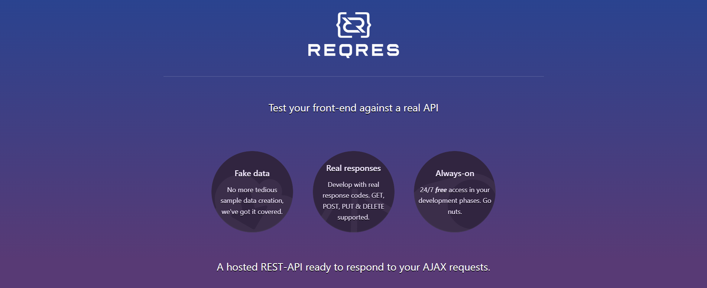
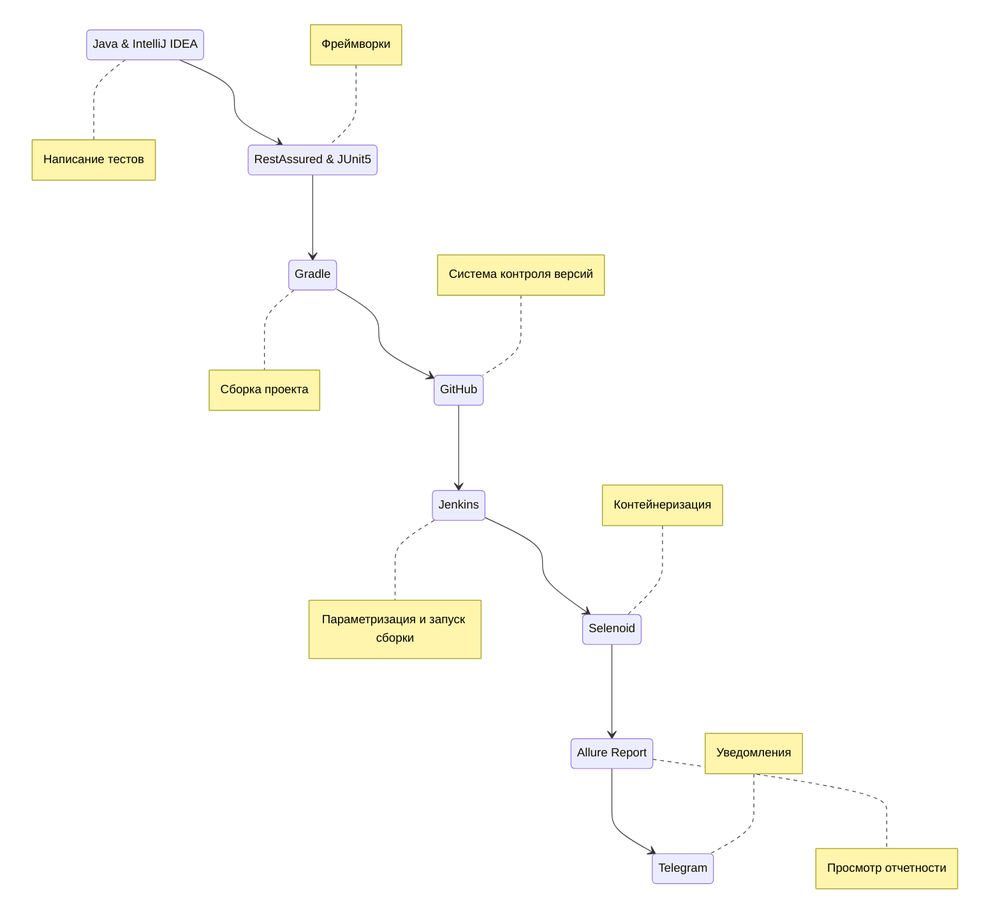
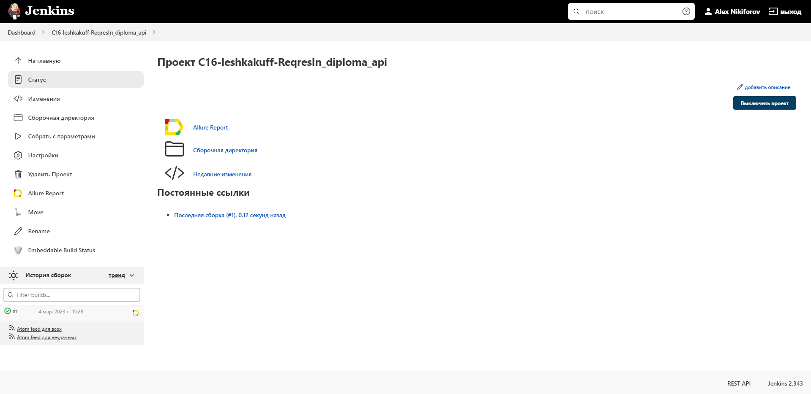
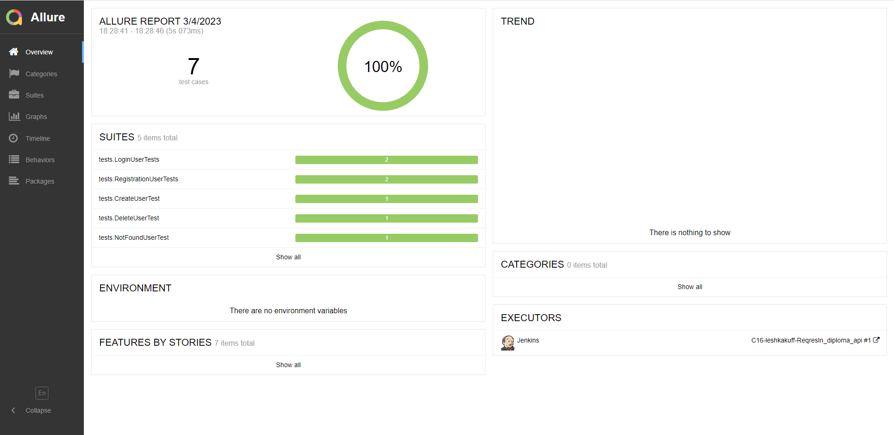
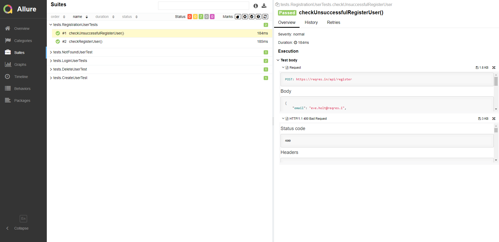
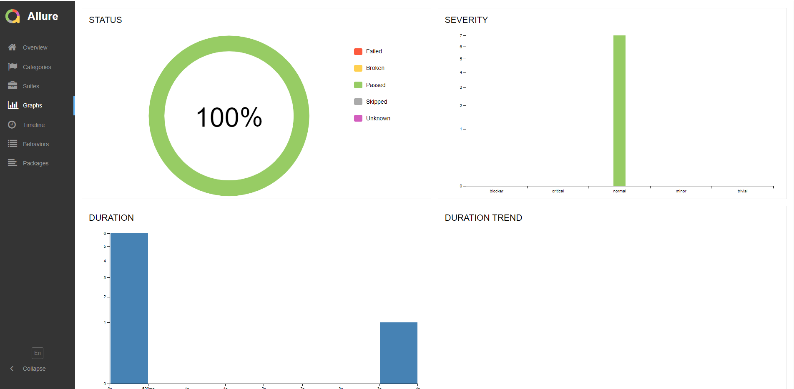
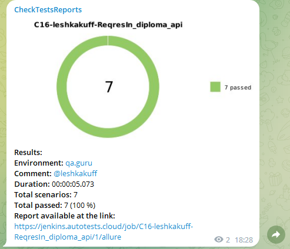

# Проект по автоматизированному тестированию API сайта "reqres.in"

<p align="center">

</p>

## <a name="bookmark_tabs-Содержание"></a>:bookmark_tabs: Содержание
➠ [Покрытый функционал](#checkered_flag-покрытый-функционал)

➠ [Технологический стек](#desktop_computer-Технологический-стек)

➠ [Запуск тестов из терминала](#key-запуск-тестов-из-терминала)

➠ [Удаленный запуск тестов в Jenkins](#-удаленный-запуск-тестов-в-Jenkins)

➠ [Отчет о результатах тестирования в Allure Report](#-отчет-о-результатах-тестирования-в-allure-report)

➠ [Уведомления в Telegram с использованием бота](#-уведомления-в-telegram-с-использованием-бота)

## <a name="checkered_flag-покрытый-функционал"></a>:checkered_flag: Покрытый функционал

### API тесты

- [x] Проверка на обновление пользователя 
- [x] Проверка удаления пользователя
- [x] Проверка регистрации пользователя с корректными/некоректными данными
- [x] Проверка захода на сайт пользователем с корректными/некоректными данными
- [x] Проверка на поиск несуществующего пользователя

[:arrow_up:Содержание](#bookmark_tabs-Содержание)

## <a name="desktop_computer-Технологический стек"></a>:desktop_computer: Технологический стек

<p align="center">


</p>


[:arrow_up:Содержание](#bookmark_tabs-Содержание)

## :key: Запуск тестов из терминала

### Локальный запуск тестов

```
gradle clean test
```

[:arrow_up:Содержание](#bookmark_tabs-Содержание)

##  Удаленный запуск тестов в [Jenkins](https://jenkins.autotests.cloud/job/C16-leshkakuff-ReqresIn_diploma_api/)

### Главная страница сборки

<p align="center">

</p>

[:arrow_up:Содержание](#bookmark_tabs-Содержание)

##  Отчет о результатах тестирования в [Allure Report](https://jenkins.autotests.cloud/job/C16-leshkakuff-ReqresIn_diploma_api/1/allure/#)

### :large_orange_diamond: Главная страница Allure-отчета

<p align="center">

</p>

### :large_orange_diamond: Страница с тестами

<p align="center">

</p>

> Каждый тест имеет:
> - Request 
>- Response
### :large_orange_diamond: Основной дашборд

<p align="center">

</p>

[:arrow_up:Содержание](#bookmark_tabs-Содержание)

##  Уведомления в Telegram с использованием бота

> По результатам каждой сборки Telegram-бот отправляет отчет в специальный телеграм-чат. 
>
> Информация по настройке и использованию бота <code>https://github.com/qa-guru/allure-notifications</code>

<p align="center">

</p>

[:arrow_up:Содержание](#bookmark_tabs-Содержание)
